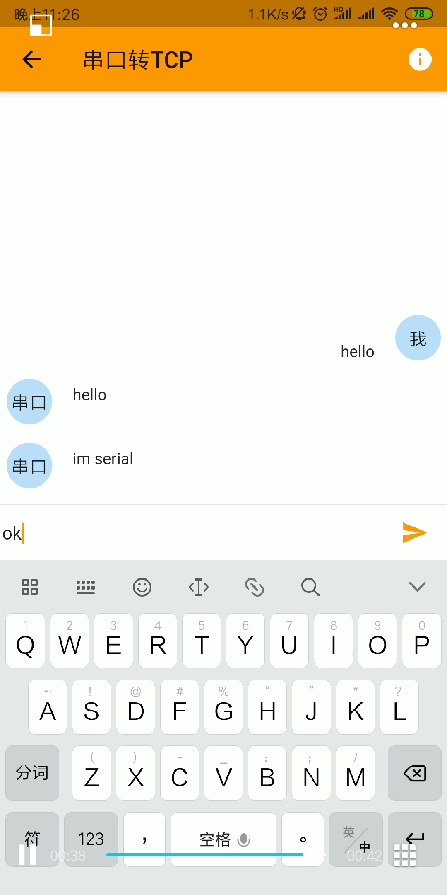

# UART2TCP
## 简介
 一个利用esp8266，实现串口到TCP，TCP到串口的数据转发的项目，可以理解为串口透传  
 
#### 功能
 手机APP自动发现该esp8266设备，app发送数据到esp8266，esp8266自动转发到串口，esp8266串口接收到数据之后自动转发到APP(见本页软件主界面截图)  
 
 ## 注意
 本项目是使用VS Code + Platform IO 来构建的，需要在其它IDE上编译的，请自行解决库的问题

> ## control with app(使用以下app操控)：
> * https://github.com/OpenIoTHub/OpenIoTHub
> * 此程序会自动发现设备，将设备放入智能设备列表

#### 配网和发现  
  * 本固件使用smartconfig配网方式
  * 直接在APP"+"进入配网界面输入wifi密码配网
  * APP在同一个局域网自动发现该设备

#### 支持的功能：
- [x] 1.与esp8266串口收发数据

#### 项目使用的硬件  
  * esp8266  

#### 波特率  
  * 默认波特率为115200  

#### 远程  
  * 支持云易连APP通过网关方式远程  

#### 界面
  * 主界面

